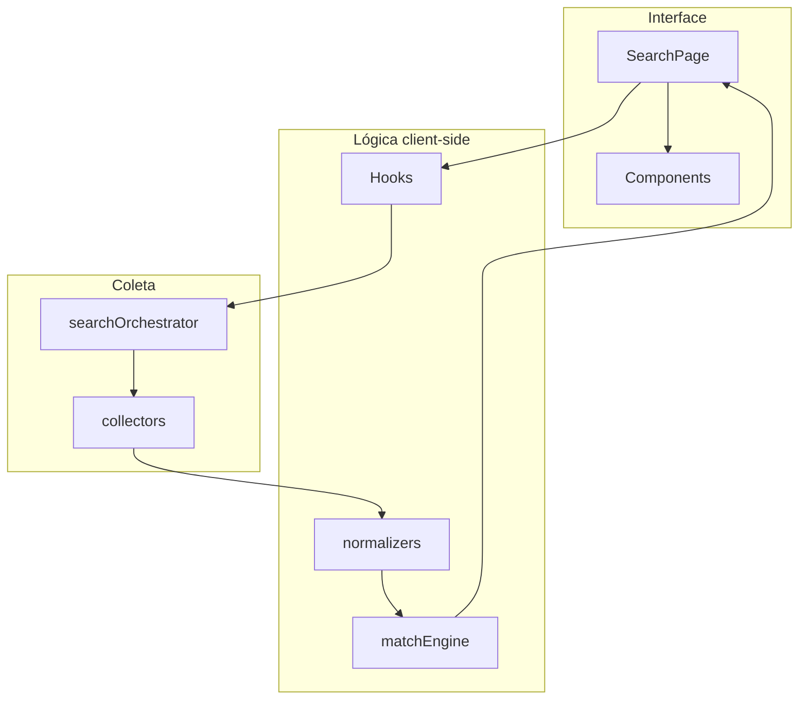

# Freela Finder — Documentação do Front-end

Documentação técnica da v1 **100% client-side**. Sem API própria, sem autenticação, sem banco — apenas React + JavaScript buscando fontes públicas e filtrando no navegador.

**Stack v1:**

| Item | Escolha |
|------|---------|
| Framework | React 19 (JavaScript) |
| Build | Vite 8 |
| UI | Material UI (MUI) v9 |
| Roteamento | react-router-dom v7 |
| Formulários | react-hook-form + yup |
| HTTP | `fetch` nativo |
| Estado | `useState` / `useReducer` + Context leve (opcional) |
| Persistência | `localStorage` só para preferências (filtros, pitch) — **não** para oportunidades |
| Feedback | notistack |
| Datas | dayjs |
| Testes | Vitest + Testing Library |
| Fonte | `@fontsource/nunito` |

---

## 1. Arquitetura



| Camada | Responsabilidade |
|--------|------------------|
| **Pages** | Tela `/busca` — formulário + resultados |
| **Components** | Filtros, tabela/cards, chips de stack, loading |
| **Hooks** | `useSearch`, `useLocalPreferences`, `useDebounce` |
| **collectors/** | Uma função async por fonte externa |
| **normalizers/** | Payload da fonte → `Opportunity` |
| **engines/matchEngine.js** | Score, exclusão, tier |
| **services/searchOrchestrator.js** | Orquestra coletores em paralelo |

**Regra:** coletores **não** filtram por stack — só buscam e normalizam. Todo filtro de tecnologia fica no `matchEngine`.

---

## 2. Estrutura de pastas

```
freela-finder-web/
├── index.html
├── package.json
├── vite.config.js
├── .env.example
│
└── src/
    ├── main.jsx
    ├── App.jsx
    │
    ├── router/
    │   └── AppRouter.jsx
    │
    ├── pages/
    │   └── SearchPage/
    │       ├── SearchPage.jsx
    │       └── SearchPage.styled.js
    │
    ├── components/
    │   ├── layout/
    │   │   └── AppLayout/
    │   ├── search/
    │   │   ├── SearchFiltersForm/
    │   │   ├── TechChipInput/
    │   │   ├── IntentTermsInput/
    │   │   ├── SourceCheckboxGroup/
    │   │   └── PitchTemplateBox/
    │   ├── results/
    │   │   ├── SearchStatsBar/
    │   │   ├── OpportunityTable/
    │   │   ├── OpportunityCard/
    │   │   ├── MatchTierChip/
    │   │   └── TechTags/
    │   └── common/
    │       ├── EmptyState/
    │       ├── LoadingOverlay/
    │       └── SourceErrorAlert/
    │
    ├── collectors/
    │   ├── remoteOkCollector.js
    │   ├── remotiveCollector.js
    │   ├── arbeitnowCollector.js
    │   ├── redditCollector.js
    │   └── index.js
    │
    ├── normalizers/
    │   ├── remoteOkNormalizer.js
    │   ├── remotiveNormalizer.js
    │   ├── arbeitnowNormalizer.js
    │   ├── redditNormalizer.js
    │   └── index.js
    │
    ├── engines/
    │   ├── matchEngine.js
    │   ├── dedupe.js
    │   └── techSynonyms.js
    │
    ├── services/
    │   ├── searchOrchestrator.js
    │   └── preferencesService.js
    │
    ├── hooks/
    │   ├── useSearch.js
    │   ├── useLocalPreferences.js
    │   └── useDebounce.js
    │
    ├── config/
    │   ├── constants.js
    │   ├── defaultIntentTerms.js
    │   ├── defaultTechSuggestions.js
    │   └── sources.js
    │
    ├── schemas/
    │   └── searchSchema.js
    │
    ├── utils/
    │   ├── hashId.js
    │   ├── textMatch.js
    │   └── copyToClipboard.js
    │
    ├── context/
    │   └── SnackbarProvider.jsx
    │
    ├── theme/
    │   └── theme.js
    │
    └── test/
        ├── setup.js
        ├── matchEngine.test.js
        └── normalizers.test.js
```

**Padrão por componente:** `Nome/Nome.jsx` + `Nome.styled.js` (objetos `*Sx` via prop `sx` do MUI).

---

## 3. Dependências (`package.json`)

```json
{
  "name": "freela-finder-web",
  "private": true,
  "type": "module",
  "scripts": {
    "dev": "vite",
    "build": "vite build",
    "preview": "vite preview",
    "test": "vitest"
  },
  "dependencies": {
    "@emotion/react": "^11.14.0",
    "@emotion/styled": "^11.14.0",
    "@fontsource/nunito": "^5.2.0",
    "@hookform/resolvers": "^5.4.0",
    "@mui/icons-material": "^9.0.0",
    "@mui/material": "^9.0.0",
    "dayjs": "^1.11.0",
    "notistack": "^3.0.0",
    "react": "^19.2.0",
    "react-dom": "^19.2.0",
    "react-hook-form": "^7.76.0",
    "react-router-dom": "^7.15.0",
    "yup": "^1.7.0"
  },
  "devDependencies": {
    "@testing-library/react": "^16.3.0",
    "@vitejs/plugin-react": "^6.0.0",
    "vitest": "^3.2.0",
    "vite": "^8.0.0"
  }
}
```

---

## 4. Variáveis de ambiente

```bash
# .env.example

# Opcional — Reddit (aumenta rate limit)
VITE_REDDIT_CLIENT_ID=
VITE_REDDIT_CLIENT_SECRET=

# Opcional — busca por intenção na web (fase 2+)
VITE_GOOGLE_CSE_API_KEY=
VITE_GOOGLE_CSE_CX=
```

| Variável | Obrigatória v1 | Uso |
|----------|----------------|-----|
| `VITE_REDDIT_*` | Não | Reddit funciona sem auth em modo limitado |
| `VITE_GOOGLE_CSE_*` | Não | Google Custom Search — fase 2+ |

---

## 5. Coletores

Cada coletor exporta uma função com assinatura única:

```javascript
/**
 * @param {import('../types').SearchParams} params
 * @returns {Promise<import('../types').RawFetchResult>}
 */
export async function collectRemoteOk(params) {
  // ...
}
```

### `RawFetchResult`

```javascript
{
  source: 'remoteok',
  items: object[],      // payload bruto
  error: string | null
}
```

### Fontes v1

#### RemoteOK

```javascript
// GET https://remoteok.com/api
// CORS: permitido
// Query local: filtrar por tags após normalização
```

#### Remotive

```javascript
// GET https://remotive.com/api/remote-jobs
// CORS: permitido
// Params: category=software-dev (opcional)
```

#### Arbeitnow

```javascript
// GET https://www.arbeitnow.com/api/job-board-api
// CORS: permitido
```

#### Reddit

```javascript
// GET https://www.reddit.com/r/forhire/search.json
// Params: q, sort=new, restrict_sr=on, t=week
// Subreddits sugeridos: forhire, slavelabour, brdev, programming
// Rate limit: respeitar headers; delay entre subreddits se necessário
```

### Registro de coletores

```javascript
// src/collectors/index.js
import { collectRemoteOk } from './remoteOkCollector';
import { collectRemotive } from './remotiveCollector';
import { collectArbeitnow } from './arbeitnowCollector';
import { collectReddit } from './redditCollector';

export const COLLECTORS = {
  remoteok: collectRemoteOk,
  remotive: collectRemotive,
  arbeitnow: collectArbeitnow,
  reddit: collectReddit,
};
```

---

## 6. Normalizers

Convertem item bruto → `Opportunity` (sem `matchScore` ainda).

```javascript
// src/normalizers/remoteOkNormalizer.js
export function normalizeRemoteOkItem(item) {
  return {
    id: `remoteok-${item.id}`,
    title: item.position || item.title,
    description: stripHtml(item.description || ''),
    url: item.url,
    source: 'remoteok',
    sourceLabel: 'RemoteOK',
    publishedAt: item.date || null,
    technologies: extractTechnologies(item.tags || []),
    intentSignals: [],
    matchScore: 0,
    tier: 'low',
    excludedReason: null,
    raw: import.meta.env.DEV ? item : undefined,
  };
}
```

`extractTechnologies` usa `techSynonyms.js` para mapear tags e texto → lista canônica (`node`, `react`, etc.).

---

## 7. Motor de match (`matchEngine.js`)

```javascript
/**
 * @param {Opportunity[]} opportunities
 * @param {SearchParams} params
 * @returns {{ opportunities: Opportunity[], stats: object }}
 */
export function applyMatchEngine(opportunities, params) {
  const stats = {
    totalFetched: opportunities.length,
    afterDedupe: 0,
    excludedByTech: 0,
    excludedByAge: 0,
    excludedByScore: 0,
    finalCount: 0,
    sourceErrors: [],
  };

  const deduped = dedupeByUrl(opportunities);
  stats.afterDedupe = deduped.length;

  const scored = deduped
    .map((opp) => scoreOpportunity(opp, params))
    .filter((opp) => {
      if (opp.excludedReason === 'exclude_tech') {
        stats.excludedByTech++;
        return false;
      }
      if (opp.excludedReason === 'max_age') {
        stats.excludedByAge++;
        return false;
      }
      if (opp.matchScore < params.minMatchScore) {
        stats.excludedByScore++;
        return false;
      }
      if (params.strictMode && opp.matchScore === 0) {
        stats.excludedByScore++;
        return false;
      }
      return true;
    })
    .sort((a, b) => b.matchScore - a.matchScore);

  stats.finalCount = scored.length;
  return { opportunities: scored, stats };
}
```

### Regra de exclusão

```javascript
function containsExcludedTech(text, excludeList) {
  const normalized = normalizeText(text);
  return excludeList.some((tech) =>
    getSynonyms(tech).some((syn) => wordMatch(normalized, syn))
  );
}
```

Se **qualquer** tech excluída aparecer em título + descrição + tags → `excludedReason: 'exclude_tech'`.

### Cálculo de tier

```javascript
function toTier(score) {
  if (score >= 75) return 'high';
  if (score >= 50) return 'medium';
  return 'low';
}
```

---

## 8. Orquestrador (`searchOrchestrator.js`)

```javascript
import { COLLECTORS } from '../collectors';
import { NORMALIZERS } from '../normalizers';
import { applyMatchEngine } from '../engines/matchEngine';

export async function runSearch(params) {
  const activeSources = params.sources?.length
    ? params.sources
    : Object.keys(COLLECTORS);

  const results = await Promise.allSettled(
    activeSources.map(async (source) => {
      const raw = await COLLECTORS[source](params);
      if (raw.error) throw new Error(raw.error);
      const normalize = NORMALIZERS[source];
      return raw.items.map(normalize);
    })
  );

  const sourceErrors = [];
  const allOpportunities = [];

  results.forEach((result, index) => {
    const source = activeSources[index];
    if (result.status === 'fulfilled') {
      allOpportunities.push(...result.value);
    } else {
      sourceErrors.push({
        source,
        message: result.reason?.message || 'Erro desconhecido',
      });
    }
  });

  const { opportunities, stats } = applyMatchEngine(allOpportunities, params);
  stats.sourceErrors = sourceErrors;

  return {
    opportunities,
    stats,
    searchedAt: new Date().toISOString(),
  };
}
```

---

## 9. Hook `useSearch`

```javascript
export function useSearch() {
  const [status, setStatus] = useState('idle'); // idle | loading | success | error
  const [result, setResult] = useState(null);
  const [error, setError] = useState(null);

  const search = useCallback(async (params) => {
    setStatus('loading');
    setError(null);
    try {
      const data = await runSearch(params);
      setResult(data);
      setStatus('success');
    } catch (e) {
      setError(e.message);
      setStatus('error');
    }
  }, []);

  const reset = useCallback(() => {
    setStatus('idle');
    setResult(null);
    setError(null);
  }, []);

  return { status, result, error, search, reset };
}
```

---

## 10. Preferências locais (`preferencesService.js`)

**Somente** filtros e pitch — nunca oportunidades.

```javascript
const STORAGE_KEY = 'freela-finder-preferences';

export function loadPreferences() {
  try {
    const raw = localStorage.getItem(STORAGE_KEY);
    return raw ? JSON.parse(raw) : null;
  } catch {
    return null;
  }
}

export function savePreferences(prefs) {
  localStorage.setItem(STORAGE_KEY, JSON.stringify({
    includeTech: prefs.includeTech,
    excludeTech: prefs.excludeTech,
    intentTerms: prefs.intentTerms,
    strictMode: prefs.strictMode,
    pitchTemplate: prefs.pitchTemplate,
    sources: prefs.sources,
  }));
}
```

---

## 11. Rotas

O `BrowserRouter` fica em `main.jsx` com `basename={import.meta.env.BASE_URL}` (necessário no GitHub Pages — ver `DEPLOY.md`).

```javascript
// src/main.jsx
import { StrictMode } from 'react';
import { createRoot } from 'react-dom/client';
import { BrowserRouter } from 'react-router-dom';
import { App } from './App';

createRoot(document.getElementById('root')).render(
  <StrictMode>
    <BrowserRouter basename={import.meta.env.BASE_URL}>
      <App />
    </BrowserRouter>
  </StrictMode>
);
```

```javascript
// src/router/AppRouter.jsx
import { Routes, Route, Navigate } from 'react-router-dom';
import { SearchPage } from '../pages/SearchPage/SearchPage';

export function AppRouter() {
  return (
    <Routes>
      <Route path="/" element={<Navigate to="/busca" replace />} />
      <Route path="/busca" element={<SearchPage />} />
      <Route path="*" element={<Navigate to="/busca" replace />} />
    </Routes>
  );
}
```

Sem `AuthSessionGuard` — app aberto direto.

---

## 12. Tela `SearchPage`

### Layout

```
┌─────────────────────────────────────────────────────────┐
│  Freela Finder                              [tema]      │
├─────────────────────────────────────────────────────────┤
│  FILTROS (Paper)                                        │
│  [Incluir tech] [Excluir tech] [Termos] [Estrito ✓]     │
│  [Região] [Fontes] [Idade máx]                          │
│  [ Buscar oportunidades ]                               │
├─────────────────────────────────────────────────────────┤
│  STATS: 12 resultados · 34 descartados · 4 fontes       │
├─────────────────────────────────────────────────────────┤
│  RESULTADOS (Table desktop / Cards mobile)              │
│  Título | Fonte | Match | Stack | Data | Ações          │
└─────────────────────────────────────────────────────────┘
```

### Schema de validação (`searchSchema.js`)

```javascript
import * as yup from 'yup';

export const searchSchema = yup.object({
  includeTech: yup
    .array()
    .of(yup.string().trim().min(1))
    .min(1, 'Informe ao menos uma tecnologia')
    .required(),
  excludeTech: yup.array().of(yup.string().trim()),
  intentTerms: yup.array().of(yup.string().trim()),
  keyword: yup.string().trim(),
  strictMode: yup.boolean().default(true),
  region: yup.string().nullable(),
  maxAgeDays: yup.number().min(1).max(90).default(14),
  sources: yup.array().of(yup.string()),
  minMatchScore: yup.number().min(0).max(100).default(25),
});
```

### Valores default do formulário

```javascript
export const DEFAULT_SEARCH_VALUES = {
  includeTech: ['node', 'react', 'typescript'],
  excludeTech: ['python', 'php', 'wordpress'],
  intentTerms: [
    'preciso de dev',
    'preciso de um desenvolvedor',
    'busco desenvolvedor',
    'contratar programador',
    'need a developer',
    'hiring developer',
  ],
  keyword: '',
  strictMode: true,
  region: 'remote',
  maxAgeDays: 14,
  sources: ['remoteok', 'remotive', 'arbeitnow', 'reddit'],
  minMatchScore: 25,
};
```

---

## 13. Componentes principais

### `TechChipInput`

- Autocomplete com sugestões de `defaultTechSuggestions.js`
- Enter adiciona chip
- Backspace no input vazio remove último chip

### `OpportunityTable`

| Coluna | Componente |
|--------|------------|
| Título | `Typography` com `noWrap` + tooltip |
| Fonte | `Chip` size small |
| Match | `MatchTierChip` + score numérico |
| Stack | `TechTags` |
| Data | `dayjs(publishedAt).fromNow()` |
| Ações | `IconButton` open + copy |

### `MatchTierChip`

| Tier | Cor MUI |
|------|---------|
| `high` | `success` |
| `medium` | `warning` |
| `low` | `default` |

---

## 14. Configuração Vite

```javascript
// vite.config.js
import { defineConfig } from 'vite';
import react from '@vitejs/plugin-react';

const REPO_NAME = 'freela-finder'; // nome do repo no GitHub Pages

export default defineConfig(({ mode }) => ({
  plugins: [react()],
  base: mode === 'production' ? `/${REPO_NAME}/` : '/',
  server: {
    port: 5174,
    // Proxy opcional se alguma fonte bloquear CORS em dev:
    // proxy: {
    //   '/api/reddit': {
    //     target: 'https://www.reddit.com',
    //     changeOrigin: true,
    //     rewrite: (path) => path.replace(/^\/api\/reddit/, ''),
    //   },
    // },
  },
}));
```

### GitHub Pages

Deploy estático documentado em **`DEPLOY.md`**. Pontos obrigatórios no código:

```javascript
// src/main.jsx — basename alinhado ao base do Vite
<BrowserRouter basename={import.meta.env.BASE_URL}>
  <App />
</BrowserRouter>
```

```json
// package.json — fallback SPA para refresh em /busca
"postbuild": "node scripts/copy-404.js"
```

Workflow CI: `github-workflows/deploy-pages.yml` → copiar para `.github/workflows/` na raiz do repo.

---

## 15. Testes prioritários

| Arquivo | O que testar |
|---------|--------------|
| `matchEngine.test.js` | Exclusão Python quando filtro é Node |
| `matchEngine.test.js` | Modo estrito descarta sem stack |
| `matchEngine.test.js` | Sinônimos (`nodejs` → `node`) |
| `dedupe.test.js` | Mesma URL duas vezes → uma oportunidade |
| `remoteOkNormalizer.test.js` | Payload exemplo → Opportunity válido |

### Caso crítico

```javascript
it('exclui oportunidade com python quando excludeTech inclui python', () => {
  const opps = [{
    id: '1',
    title: 'Desenvolvedor Python Django',
    description: 'Projeto web',
    technologies: ['python'],
    // ...
  }];
  const { opportunities } = applyMatchEngine(opps, {
    includeTech: ['node'],
    excludeTech: ['python'],
    strictMode: true,
    minMatchScore: 0,
  });
  expect(opportunities).toHaveLength(0);
});
```

---

## 16. Tema e UX

- Layout simples, uma coluna em mobile
- `AppBar` com título "Freela Finder" — sem menu lateral na v1
- Loading: botão desabilitado + `LinearProgress` abaixo dos filtros
- Erros de fonte: `SourceErrorAlert` colapsável (não bloqueia resultados das outras)
- Empty state com texto: *"Nenhuma oportunidade com esses filtros. Tente afrouxar exclusões ou incluir mais fontes."*

---

## 17. Migração futura para back-end

Quando houver API própria, a troca deve ser mínima:

```javascript
// hoje
import { runSearch } from '../services/searchOrchestrator';

// futuro
import { api } from '../services/apiClient';
const data = await api.post('/api/searches/run', params);
```

Manter a mesma interface `SearchResult` e `Opportunity` no front. Mover `collectors/` e `matchEngine` para o servidor; o front vira consumidor da API.

---

## 18. Checklist de implementação

### Semana 1

- [ ] Scaffold Vite + React + MUI
- [ ] `SearchPage` com formulário
- [ ] `remoteOkCollector` + normalizer
- [ ] `matchEngine` com incluir/excluir
- [ ] Tabela de resultados + abrir link

### Semana 2

- [ ] `remotive`, `arbeitnow`, `reddit` collectors
- [ ] Stats bar e erros por fonte
- [ ] `localStorage` para filtros e pitch
- [ ] Testes do match engine
- [ ] Build e uso pessoal real
